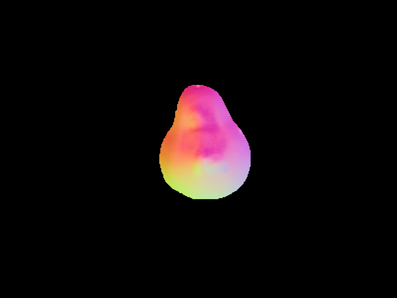
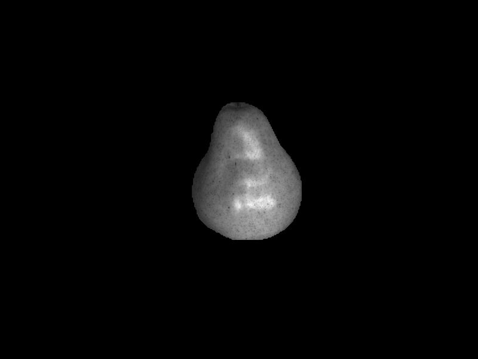
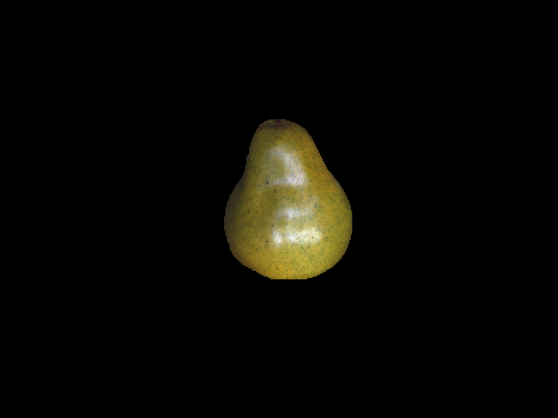
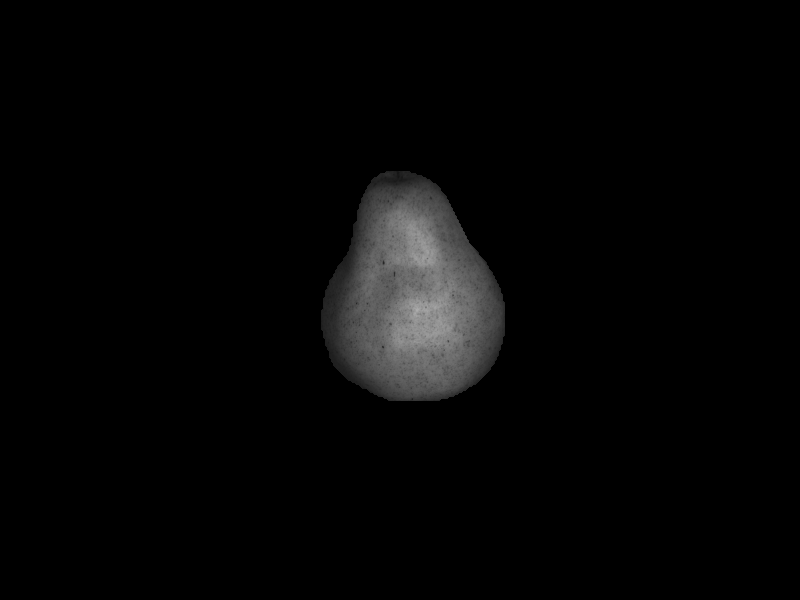
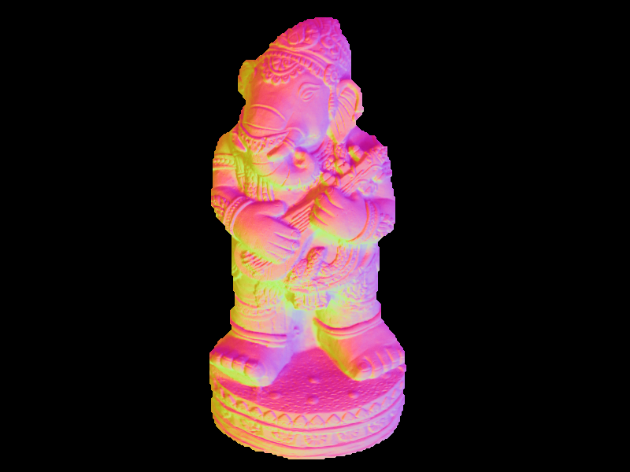
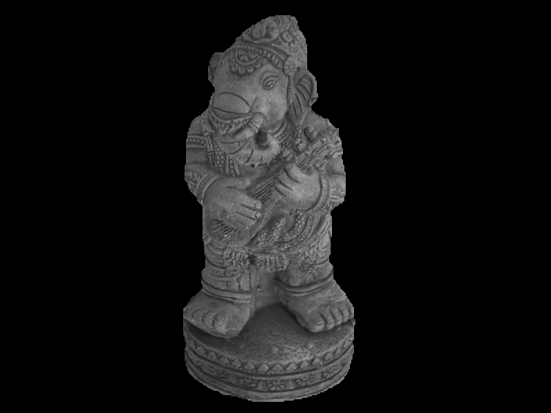
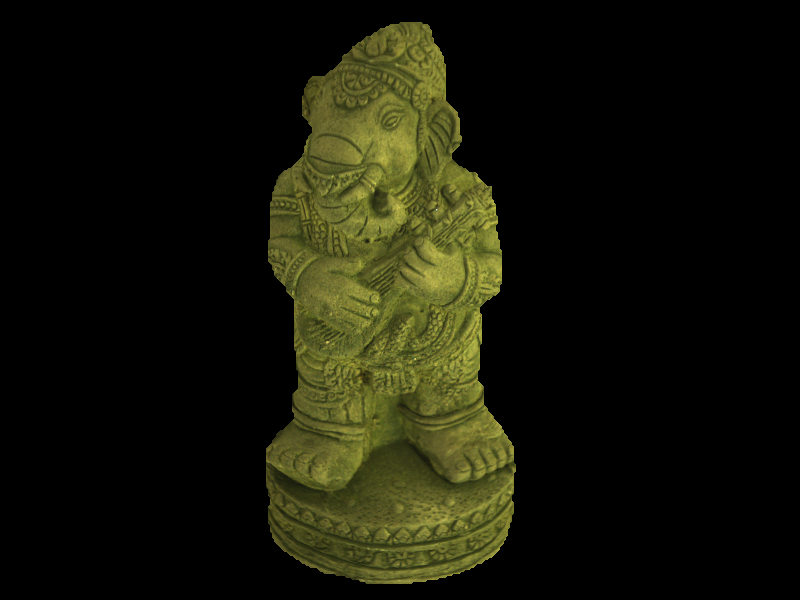
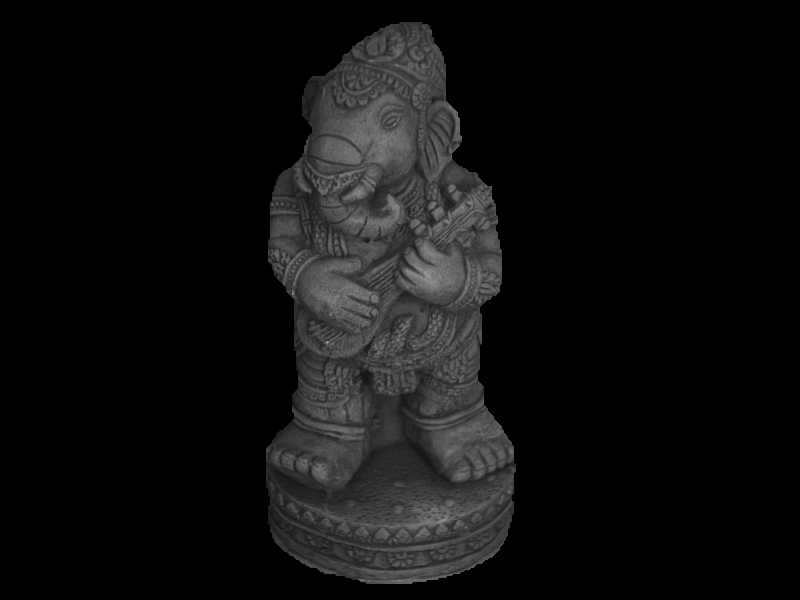

# Photometric-Stereo

<h1 align="center"><Photometric Stereo Algorithm></h1>

Given 3+ images of an object taken from different angles, the algorithm reconstructs 3D shape of that object object using the photometric stereo approach. Theory is overviewed in “Physics‐Based Vision: Principles and Practice, Shape Recovery” by Wolff, Shafer, Healey, and Peters (1992), and “Chapter 1 Photometric Stereo: An Overview” by Argyriou and Petrou (2009). 

In the project directory, you can run:

#### `python pstereo.py \Apple`
`pstereo.py` from the command line with an argument `input_path` set to the location of input images. Output images are automatically saved within that folder into "Results".

### Screenshots

  
   
  
  

  
   
  
  

### Built With

- Python
- CV2
- Numpy
- GDAL
